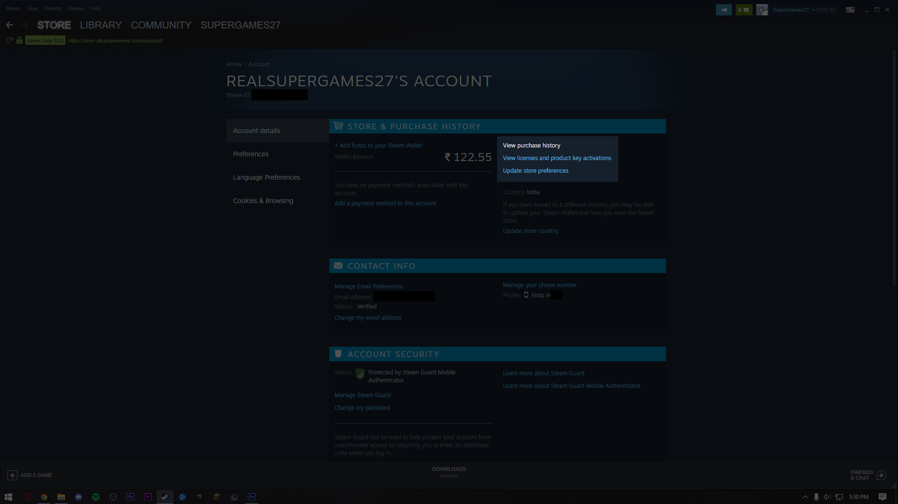
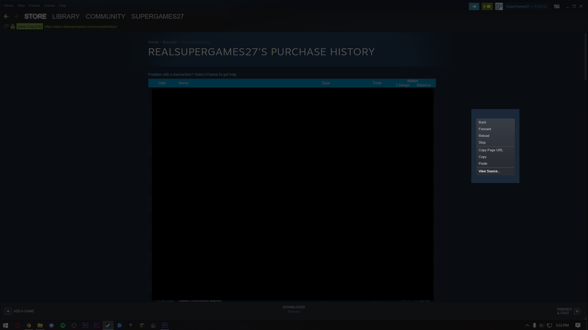
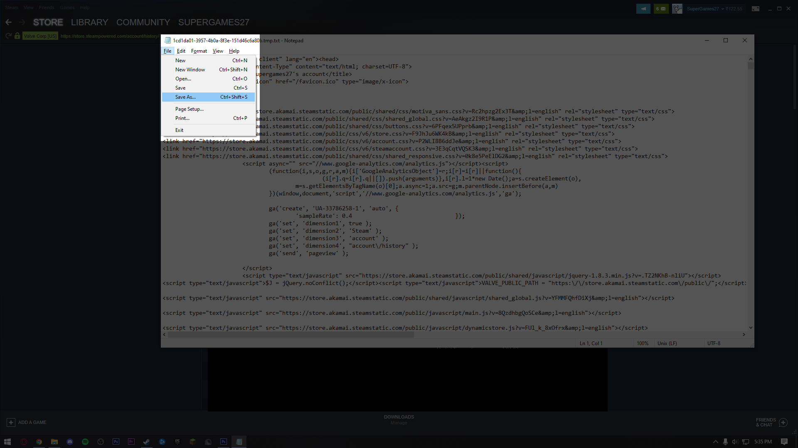
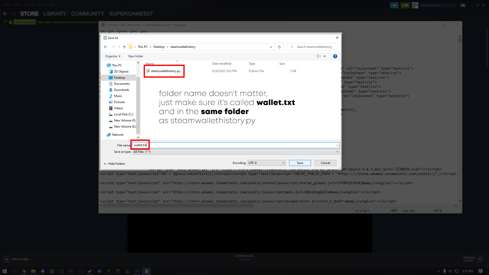
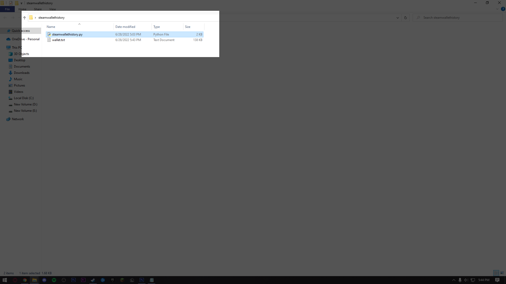
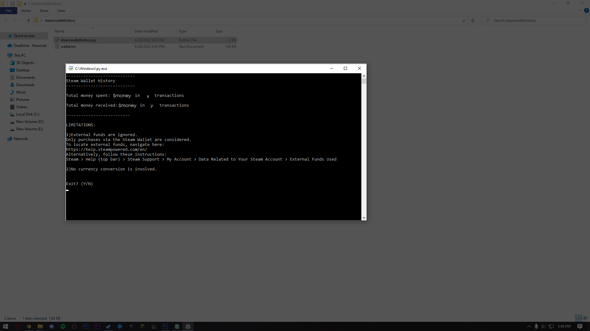

# Steam Wallet History
Find total amount you've spent and received via Steam Wallet.

Limitations: 
* Does not work when more than one currency is involved.
* Excludes external funds. To find external funds, go to https://help.steampowered.com/en/accountdata/AccountSpend
* Issues when commas are involved
* sometimes decides to stop working, i still have no clue why. i'll edit this when i figure it out

Instructions:

1. Launch Steam
2. Click on your name in the top right corner and go to 'Account Details'

3. Click on 'View purchase history'

4. Right click anywhere on the page and click 'View Source...'

5. Save the text file as 'wallet.txt' in the same folder as 'steamwallethistory.py'

6. Run 'steamwallethistory.py'

